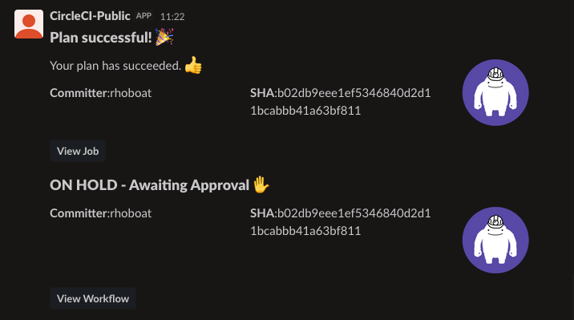

# Configure Gruntwork Pipelines

In the previous section, you saw [how to deploy your apps into the Reference Architecture](03-deploy-apps.md). Now it's
time to see how to configure a CI / CD pipeline to automate deployments.

If you are not familiar with Gruntwork Pipelines, you can learn more by reading the Gruntwork Production Deployment Guide
[How to configure a production-grade CI-CD workflow for infrastructure
code](https://gruntwork.io/guides/automations/how-to-configure-a-production-grade-ci-cd-setup-for-apps-and-infrastructure-code/).

* [CI / CD pipeline for infrastructure code](#ci--cd-pipeline-for-infrastructure-code): How to configure a CI / CD
  pipeline for infrastructure code, such as Terraform modules that configure your VPCs, databases, DNS settings, etc.

* [CI / CD pipeline for app code](#ci--cd-pipeline-for-app-code): How to configure a CI / CD pipeline for application
  code, such as a Ruby, Python, PHP, or Java web service packaged with Packer or Docker.

* [Update the CI / CD pipeline itself](#update-the-ci--cd-pipeline-itself): How to pull in changes to the pipeline from
  `terraform-aws-ci` and redeploy pipeline containers.


## CI / CD pipeline for infrastructure code

This diagram shows a rough overview of the Gruntwork Pipelines architecture:


The Gruntwork Pipelines workflow, defined in [`.circleci/config.yml`](/.circleci/config.yml), works like this:


- A CI server is hooked up to watch for changes in your `infrastructure-live` repository.
- Every time a new commit is pushed, the CI server looks for modules that have changed in the repository.
- For each module that changed, trigger a `plan` action on the module by invoking the ECS deploy runner.
- The ECS deploy runner is invoked using an AWS Lambda function that exposes a limited range of actions that can be
  performed in a deploy container that has all the necessary tools installed.
- The infrastructure code runs from within a Docker container in an ECS task on Fargate. This task is what has the
  powerful AWS credentials to deploy infrastructure.
- If the job was triggered on the `main` branch of the repository, the CI server will run `plan`.
- If the Slack integration is set up, a notification will be sent to the Slack channel that the job is awaiting
approval.
- Once the job is manually approved. the CI server will run `apply`. The Slack integration will post a notification
about whether the apply failed or succeeded.

### Set up the pipeline in your own organization
First make sure you've copied the repo into your own GitHub organization, as `infrastructure-live`. The CircleCI job is already configured in `<YOUR_REPO_ROOT>/.circleci/config.yml`. Here are the additional steps to get the job running successfully:

#### View the failed job
1. Login to CircleCI.
1. Switch to your company's GitHub organization using the left panel.

   

1. Switch to the Projects tab using the left panel.
1. Search for your infrastructure-live repository and click **Set Up Project.**
1. Click **Start Building**.

You should see a job kicked off that failed.

   

We'll now fix this job so that it passes, by adding some Environment Variables that are missing.

#### Get the machine user credentials from AWS
1. Log into the Security account in the AWS Console.
1. Go into IAM and find the ci-machine-user under Users.
1. Go to Security Credentials > Access Keys > Create Access Key.
1. Save these values as the `AWS_ACCESS_KEY_ID` and the `AWS_SECRET_ACCESS_KEY` Environment Variables in CircleCI.

#### CircleCI Environment Variables
1. Login to CircleCI.
1. Go into your project again, so you see the list of failed builds.
1. Click on **Project Settings** (the upper right button, above **Auto-expand**).
1. Click on **Environment Variables** and configure the following environment variables:

| Env var name | Value |
| --- | --- |
| AWS_ACCESS_KEY_ID | The Access Key generated for the machine user in the Security account. |
| AWS_SECRET_ACCESS_KEY | The Secret Key generated for the machine user in the Security account. |
| GITHUB_OAUTH_TOKEN | Enter the MachineUserGitHubPAT here. You can find this in [`reference-architecture-form.yml`](../reference-architecture-form.yml) or in the shared account's Secrets Manager. |

#### Set up the Slack integration

1. Create a Slack App
    1. Visit [your apps](https://api.slack.com/apps) on the Slack API website, and click `Create New App`.
    1. Name your application (e.g., `CircleCI` or `CircleCI-Pipeline`).
    1. Then select the Slack workspace in which to install this app.
1. Set Permissions
    1. On the next page select the "Permissions" area, and add these 3 "scopes".
        * chat:write
        * chat:write.public
        * files:write

   
1. Install and Receive Token
    1. Install the application into the Slack workspace and save your OAuth Access Token. This will be used in
       a CircleCI environment variable.

   

   
1. Choose a Slack channel to notify
    1. Choose or create a Slack channel in your workspace to notify with pipeline updates.
    1. Right-click the channel name. You'll see a context menu.
    1. Select `Copy link`.
    1. Extract the Channel ID from the URL copied. E.g., `https://<org>.slack.com/archives/<CHANNEL_ID>`
1. Create env vars on CircleCI
    1. Login to CircleCI. Navigate to **Project Settings** -> **Environment Variables**.
    1. Configure the following environment variables:

| Env var name | Value |
| --- | --- |
| SLACK_ACCESS_TOKEN | The OAuth token acquired through the previous step. |
| SLACK_DEFAULT_CHANNEL | If no channel ID is specified, the app will attempt to post here. |

#### Verify the job succeeds
1. On the project build page, rerun the failed job using the icons to the right of the job.
1. The `plan` step should succeed. Since the job is happening on the `main` branch, the job should hit the
`hold` phase and wait for your approval.

   

1. You should get a Slack notification telling you the plan succeeded and that the job is being held for
approval.

   

1. Approve the job.

   

1. The job should succeed!

   

1. You should also get a Slack notification that the apply succeeded.

   


### Try it out


You can try out the pipeline by making a change to one of the modules. For example, try extending
the number of replicas in the sample app:

1. Create a new branch in the `infrastructure-live` repo.
    `git checkout -B add-replica-to-sample-app`.
1. Open the file `dev/us-west-2/dev/services/sample-app-frontend` in your editor.
1. Change the input variable `desired_number_of_pods` to `2`.

1. Commit the change.
    `git commit -a`.
1. Push the branch to GitHub and open a PR.
    `git push add-replica-to-sample-app`
1. Login to CircleCI. Navigate to your infrastructure-live project.
1. Click on the new pipeline job for the branch `add-replica-to-sample-app` to see the build log.
1. Verify the `plan`. Make sure that the change corresponds to adding a new replica to the EKS service.

1. When satisfied with the plan, merge the PR into `main`.
1. Go back to the project and verify a new build is started on the `main` branch.
1. Wait for the `plan` to finish. The build should hold for approval.
1. Approve the deployment by clicking `Approve`.
1. Wait for the `apply` to finish.
1. Login to the AWS console and verify the EKS service now has 2 replicas.


### Destroying infrastructure

At this moment, the CI/CD pipeline for infrastructure code does not natively support destroying infrastructure. You must
manually run the `destroy` call outside the CI pipeline when you want to destroy infrastructure.

The steps for destroy are:

1. Run `terragrunt destroy` in the folder you wish to destroy.
1. You should see the destroy plan and a prompt to confirm the destroy action. Review the plan and make sure it looks
   good to you. If it looks good, approve the plan by replying `yes` to the prompt.
1. Once the infrastructure destroy completes, remove the module folder from git using `git rm -r` and commit the change.
   Make sure to commit the change on a new branch.
1. Open a new PR on the branch to be reviewed by a colleague. Note that the CI pipeline will ignore this changeset as it
   is designed to filter out any changes that remove modules.
1. Go through the normal review process to get the change merged in.

NOTE: We are actively working on improvements to the Gruntwork Pipelines solution to support automated destroy
workflows. Refer to [this issue in terraform-aws-ci](https://github.com/gruntwork-io/terraform-aws-ci/issues/162) for
more information. Please subscribe to that ticket to be notified when support for destroy workflows is implemented.


## CI / CD pipeline for app code

The Reference Architecture also includes configuration files for setting up a CI / CD pipeline for your application code.
You can find configurations for application CI / CD in the folder `_ci/app-templates`:

```
_ci/app-templates
├── .circleci
│   └── config.yml
└── scripts
    ├── build-docker-image.sh
    ├── constants.sh
    ├── deploy-docker-image.sh
    └── install.sh
```

- `.circleci/config.yml`: CircleCI pipeline configuration for building and deploying dockerized applications.
- `scripts`: Helper bash scripts used to drive the CI / CD pipeline.
    - `constants.sh`: Environment variables that are shared across all the scripts
    - `install.sh`: Installer script to configure the CI runtime with necessary dependencies for running the deployment
      scripts.
    - `build-docker-image.sh`: Script used by the CI runtime to build a new docker image for the application.
    - `deploy-docker-image.sh`: Script used by the CI runtime to deploy a prebuilt docker image for the application.

This sample pipeline configures the following workflow:

- For any commit on any branch, build a new docker image using the commit SHA.
- For commits to `main`, deploy the built image to the dev environment by updating the `infrastructure-live`
  configuration for the `dev` environment.
- For release tags, deploy the built image to the stage environment by updating the `infrastructure-live` configuration
  for the `stage` environment.

In this guide, we will walk through how to setup the CI / CD pipeline for your application code.

1. [Dockerize your app](#dockerize-your-app)
1. [Create infrastructure code to deploy your app](#create-infrastructure-code-to-deploy-your-app)
1. [Enable access to your application repo from ECS deploy
   runner](#enable-access-to-your-application-repo-from-ecs-deploy-runner)
1. [Install CI / CD Configuration](#install-ci-cd-configuration)
1. [Create CircleCI Job](#create-circleci-job)


### Dockerize your app

To deploy your app on ECS or EKS, you will first need to dockerize it. If you are not familiar with the basics of
docker, check out our "Crash Course on Docker and Packer" from the [Gruntwork Training
Library](https://training.gruntwork.io/p/a-crash-course-on-docker-packer).

**Once your app is dockerized, make note of the path from the root of your application repo to the `Dockerfile`.** This value will be used in your `_ci/scripts/constants.sh` as `DOCKER_CONTEXT_PATH`.


### Create infrastructure code to deploy your app

If you've already followed the previous guide [How to deploy your apps into the Reference
Architecture](03-deploy-apps.md), you should already have your module defined in the `infrastructure-live` repository
to deploy the app.

**Make note of the path from the account folder to the service configuration.** An example path is `"dev/us-east-1/dev/services/application`. These values will be used your `.circleci/config.yml` for `DEV_DEPLOY_PATH` and `STAGE_DEPLOY_PATH`.


### Enable access to your application repo from ECS deploy runner

Now you need to explicitly enable the ECS deploy runner to access your application repo.

Because the ECS deploy runner has defacto _admin_ credentials to your AWS accounts, it is locked down so that users
cannot deploy arbitrary code into your environments.

To allow the ECS deploy runner to start building and deploying your application:

1. Open this file for editing: `shared/us-west-2/mgmt/ecs-deploy-runner/terragrunt.hcl`.
1. Update `docker_image_builder_config.allowed_repos` to include the HTTPS Git URL of the application repo.
1. Save and commit the change.
1. Deploy the change using `terragrunt apply`.


### Install CI / CD Configuration

To declare a build job in CircleCI, the application repository needs a `.circleci/config.yml` file that records the steps that
CircleCI needs to run to deploy the app. To setup your repo with a CircleCI configuration that is compatible with
Gruntwork Pipelines:

1. In your application repository, checkout a new branch: `git checkout -B circleci`
1. Copy the template files from _this_ repo to your application repo:
    - `cp -r <THIS_REPO_ROOT>/_ci/app-templates/.circleci .circleci` to copy the CircleCI config folder.
    - `mkdir _ci` to create a new folder `_ci` in your application repository root.
    - `cp -r <THIS_REPO_ROOT>/_ci/app-templates/scripts _ci` to copy scripts into the new `_ci` folder.

1. Edit `.circleci/config.yml` to fill in the environment variables at the top, especially `REGION`, `DEV_DEPLOY_PATH`,
and `STAGE_DEPLOY_PATH`.
1. Edit `_ci/scripts/constants.sh` to fill in the environment variables at the top. The `DOCKER_CONTEXT_PATH` from earlier will also go here.
1. Commit and push:

        git add .circleci
        git add _ci
        git commit
        git push -u circleci

1. Open a PR on GitHub for your branch so it can be reviewed.

Once the branch is merged, updates to the `main` branch will trigger a build job in CircleCI.


### Create CircleCI Job

Configure CircleCI to watch the repo for changes:

1. Login to CircleCI.
1. Switch to the GitHub organization that has the application repository using the left panel.

   

1. Switch to the Projects tab using the left panel.
1. Search for your application repository and click **Set Up Project.**
1. Click **Start Building**.
1. In the build page, go to **Project Settings** (the upper right button, above **Auto-expand**).
1. In the settings page, go to **Environment Variables**. Configure the following environment variables:
    - `AWS_ACCESS_KEY_ID` and `AWS_SECRET_ACCESS_KEY` : Use the AWS access key pair for the machine user that Gruntwork
      provided to you when the Reference Architecture was first set up.
    - `GITHUB_OAUTH_TOKEN` : Use the GitHub Personal Access Token for the GitHub machine user that you provided to
      Gruntwork.

## Update the CI / CD pipeline itself

The CI / CD pipeline uses the Gruntwork [terraform-aws-ci](https://github.com/gruntwork-io/terraform-aws-ci) repo code, so
whenever there's a new release, it's a good idea to update your pipeline.

Here are the manual steps for this process:

1. Update the Service Catalog version tag in the
[`build_deploy_runner_image.sh`](/shared/us-west-2/_regional/container_images/build_deploy_runner_image.sh) and
[`build_kaniko_image.sh`](/shared/us-west-2/_regional/container_images/build_kaniko_image.sh) scripts.

1. Run each script while authenticating to the `shared` account.

        aws-vault exec your-shared -- shared/us-west-2/_regional/container_images/build_deploy_runner_image.sh
        aws-vault exec your-shared -- shared/us-west-2/_regional/container_images/build_kaniko_image.sh


1. Update [`common.hcl`](/common.hcl) with new tag values for these images. The new tag value will be version of
`terraform-aws-ci` that the images use. For example, if your newly created images are using the `v0.38.9` release of
`terraform-aws-ci`, update [`common.hcl`](/common.hcl) to:

        deploy_runner_container_image_tag = "v0.38.9"
        kaniko_container_image_tag = "v0.38.9"

1. Run `apply` on the `ecs-deploy-runner` modules in each account. These can be run simultaneously in different terminal sessions.

        cd logs/us-west-2/mgmt/ecs-deploy-runner
        aws-vault exec your-logs -- terragrunt apply --terragrunt-source-update -auto-approve

        cd shared/us-west-2/mgmt/ecs-deploy-runner
        aws-vault exec your-shared -- terragrunt apply --terragrunt-source-update -auto-approve

        cd security/us-west-2/mgmt/ecs-deploy-runner
        aws-vault exec your-security -- terragrunt apply --terragrunt-source-update -auto-approve

        cd dev/us-west-2/mgmt/ecs-deploy-runner
        aws-vault exec your-dev -- terragrunt apply --terragrunt-source-update -auto-approve

        cd stage/us-west-2/mgmt/ecs-deploy-runner
        aws-vault exec your-stage -- terragrunt apply --terragrunt-source-update -auto-approve

        cd prod/us-west-2/mgmt/ecs-deploy-runner
        aws-vault exec your-prod -- terragrunt apply --terragrunt-source-update -auto-approve


### Why manually?

The CI / CD pipeline has a guard in place to avoid being updated automatically by the pipeline itself. This is so that
you cannot accidentally lock yourself out of the pipeline when applying a change to the pipeline that changes
permissions. For example, if you change the IAM permissions of the CI user, you may no longer be able to run the
pipeline. The pipeline job that updates the permissions will also be affected by the change. This can be difficult to
recover from because you will have lost access to make further changes. That's why we recommend the manual approach
detailed above.

If you are certain that your changes will not break the pipeline itself, you can go ahead and use the pipeline to
update itself. To do this, you need to remove the guard that's in place, temporarily. That is, comment or remove the
lines

        elif [[ "$updated_folder" =~ ^.+/ecs-deploy-runner(/.+)?$ ]]; then
          echo "No action defined for changes to $updated_folder."

in [`_ci/scripts/deploy-infra.sh`](/_ci/scripts/deploy-infra.sh). You can combine this change into the same commit or
pull request as your changes to the `ecs-deploy-runner` module configuration.

## Next steps

Now that your code is built, tested, and deployed, it's time to take a look at [Monitoring, Alerting, and
Logging](05-monitoring-alerting-logging.md).
