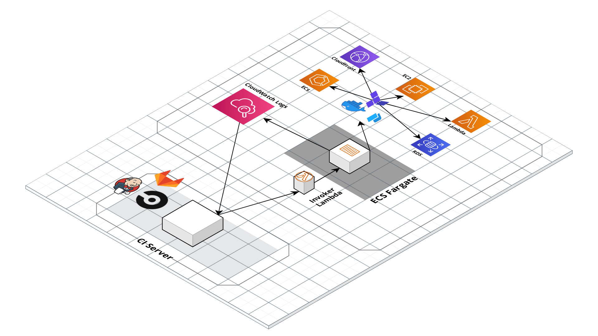

# Configure Gruntwork Pipelines

In the previous section, you saw [how to deploy your apps into the Reference Architecture](03-deploy-apps.md). Now it's
time to see how to configure a CI / CD pipeline to automate deployments.

If you are not familiar with Gruntwork Pipelines, you can learn more by reading the Gruntwork Production Deployment Guide
[How to configure a production-grade CI-CD workflow for infrastructure
code](https://gruntwork.io/guides/automations/how-to-configure-a-production-grade-ci-cd-setup-for-apps-and-infrastructure-code/).

* [CI / CD pipeline for infrastructure code](#ci--cd-pipeline-for-infrastructure-code): How to configure a CI / CD
  pipeline for infrastructure code, such as Terraform modules that configure your VPCs, databases, DNS settings, etc.

* [CI / CD pipeline for app code](#ci--cd-pipeline-for-app-code): How to configure a CI / CD pipeline for application
  code, such as a Ruby, Python, PHP, or Java web service packaged with Packer or Docker.

* [Update the CI / CD pipeline itself](#update-the-ci--cd-pipeline-itself): How to pull in changes to the pipeline from
  `terraform-aws-ci` and redeploy pipeline containers.


## CI / CD pipeline for infrastructure code

This diagram shows a rough overview of the Gruntwork Pipelines architecture:



The Gruntwork Pipelines workflow, defined in [`.github/workflows/pipelines.yml`](/.github/workflows/pipelines.yml), works like this:

- A CI server is hooked up to watch for changes in your `infrastructure-live` repository.
- Every time a new commit is pushed, the CI server looks at what changed and takes appropriate actions based on what
  files changed:
    - For each module that is removed, trigger a `plan -destroy` action on the module by invoking the ECS deploy runner.
    - For each common file that changed (anything in the `_envcommon` folder as described in
      [Terragrunt patterns used in the Reference Architecture: Multiple Includes](./appendix.md#multiple-includes)),
      trigger a `plan` action on _every module that includes that common file_ by invoking the ECS deploy runner. Note
      that each account is deployed in sequence, and the ordering is determined by the assigned `deploy_order`. Refer to
      [Appendix: Common data files](./appendix.md#common-data-files) for more information on where the `deploy_order`
      is indicated.
    - For each module (a folder containing `terragrunt.hcl`) that is newly added or modified, trigger a `plan` action on
      the module by invoking the ECS deploy runner.
- The ECS deploy runner is invoked using an AWS Lambda function that exposes a limited range of actions that can be
  performed in a deploy container that has all the necessary tools installed.
- The infrastructure code runs from within a Docker container in an ECS task on Fargate (or EC2). This task is what has the
  powerful AWS credentials to deploy infrastructure.
- CI server will run first run a `plan`.
- If the Slack integration is set up, a notification will be sent to the Slack channel that the plan succeeded or failed.
- If the plan succeeded, and if the job was triggered on the `main` branch of the repository,
  the CI server will move on to run `apply`.
    - Note that for updates to common files, the CI server will run `apply` in the deploy order.
    - If any environment fails, the CI server will halt the rollout of the changes without moving on to the next
      environments. This allows you to prevent roll out to a production environment if it fails in an earlier tier.
    - Note that Terraform and Gruntwork pipelines does not currently support a safe rollback. To resume deployment, we
      recommend either manually fixing issues (e.g., if the rollout requires a state migration), or rolling forward with
      additional code changes.
- If the Slack integration is setup, a notification will be sent to the Slack channel about whether the apply failed or
  succeeded.


### Set up the pipeline in your own organization
First, make sure you've copied the repo into your own GitHub organization as a new repository. You can name it whatever you'd like. We usually call it `infrastructure-live`. The GitHub Actions workflow is already configured in `<YOUR_REPO_ROOT>/.github/workflows/pipelines.yml`. Here are the additional steps to get the job running successfully:

#### Get the machine user credentials from AWS
1. Log into the Security account in the AWS Console.
1. Go into IAM and find the ci-machine-user under Users.
1. Go to Security Credentials > Access Keys > Create Access Key.
1. We will use these values as the `AWS_ACCESS_KEY_ID` and the `AWS_SECRET_ACCESS_KEY` below.

#### Configure a Slack Workflow
If you'd like to send Slack notifications when the pipeline is running, follow the steps in this section.

1. In Slack, open the Workflow builder:

   

1. Create a new Webhook workflow called "Gruntwork Pipelines"

   

1. Add the following text variables to the workflow: `branch`, `status`, `url`, `repo`, and `actor`

   

1. Once all of the variables are added, click Next.

1. Now add another step to the workflow

   

1. Add the "Send a message"  step

1. Choose a channel from the dropdown menu

1. In the Message Text field, paste the following contents:

    ```
    Repo: <insert the repo variable>
    Branch: <insert the branch variable>
    Actor:  <insert the actor variable>
    Status: <insert the status variable>
    Workflow URL: <<insert the url variable>
    ```

1. Use the "Insert a variable" button to insert a variable for each of the placeholders in the message above.

1. Save the Send a message step.

1. Hit the Publish button to make the Workflow live.

1. Copy the webhook URL and save it. We will use this value below.

   

1. Note that the webhook URL should be treated as sensitive. Anyone with the URL can send HTTP requests to the webhook!

#### Add secrets to GitHub
1. Open the GitHub repository and navigate to Settings => Secrets.

   

1. Create the following repository secrets:

- `AWS_ACCESS_KEY_ID`:  This is the first value from the AWS IAM user step above.
- `AWS_SECRET_ACCESS_KEY`:  This is the second value from the AWS IAM user step above.
- `GH_TOKEN`: Enter the GitHub machine user's oauth token here. If you don't know this, you can find it in the AWS Secrets Manager secret that you provided in the [`reference-architecture-form.yml`](../reference-architecture-form.yml).
- `SLACK_WEBHOOK_URL`: This is the value from the Slack Workflow step above.


#### Done!

That's it. Access the pipeline in the Actions tab in GitHub.


### Destroying infrastructure

For instructions on how to destroy infrastructure, see the [Undeploy guide](07-undeploy.md).


### Rolling out changes to `_envcommon`

There are two ways to roll out changes to common configuration files (the files in the `_envcommon` folder):

- [Using the default pipeline behavior to roll out the change at
  once.](#using-the-default-pipeline-behavior-to-roll-out-the-changes-at-once)
- [Incrementally promote the change across the environments.](#incrementally-promote-the-change-across-the-environments)

The pipeline supports both approaches. Which approach you go with depends on the risk tolerance of your team, and the
risk level of the change you are trying to make. For example, updating tags across resources might be a safe change that
can be rolled out across all environments at once without incremental approval. On the other hand, you may want more
control over updating the major engine version of a database. Both approaches are valid, and we recommend adapting your
approach to the one that best fits your needs.

#### Using the default pipeline behavior to roll out the changes at once

In the section above, we provided an overview of the CI/CD pipeline for the infrastructure code we ship with the
Reference Architecture. The specific pipeline we ship handles the common files by deploying them in a loop based on [the
configured deploy order](./06-adding-a-new-account.md#set-the-deploy-order). For example, if you updated
[`_envcommon/networking/vpc-app.hcl`](/_envcommon/networking/vpc-app.hcl), the pipeline will deploy the following
modules in order:

- `dev/us-west-2/dev/networking/vpc`
- `stage/us-west-2/stage/networking/vpc`
- `prod/us-west-2/prod/networking/vpc`

This deployment follows the standard pipeline. That is, the pipeline runs `plan` on the modules when the change is
introduced in a PR, and then runs `apply` when the change is merged into `main`. This pipeline
provides a convenient way to roll out changes that affect all environments, but has the following drawbacks:

- To deploy the change, the code change must be merged into the `main` branch. This means that
  there is risk to leave the infrastructure in an inconsistent state. For example, if there was a problem rolling out
  the change to the `stage` environment, but none for `dev`, you could end up in a partially rolled out state where the
  change was rolled out to `dev` and not the other environments. This could be problematic when you then try to update
  `prod` for the same module, as the code change is now committed in the `main` where all
  changes stem from.
- The approval chain is for all environments, not one at a time. You won't be able to partially approve the change,
  where you want to approve the deployment for `dev` but not `stage` or `prod`.
- The output of the deployment is combined into one stream, making it harder to read. It won't be clear if the `plan`
  you are reviewing is for the `prod` environment, or the `dev` environment, unless you scroll to the beginning of the
  logs and read the lines carefully.

#### Incrementally promote the change across the environments

If you wish for an alternative workflow to roll out changes to `_envcommon` that trades off convenience for deployment
control, you can take the following, step wise promotion approach:

1. Make the change to the corresponding `terragrunt` module in the `dev` folder, such that it would override the common
   settings. This change should be rolled out in isolation. E.g.:
    1. Open a PR to update `dev/us-west-2/dev/networking/vpc` with the change you want to make.
    1. Review and merge the PR independently of the other environments. The pipeline should run only against the `dev`
       environment.
    1. Check the deployed infrastructure to make sure it was successfully rolled out to the `dev` environment.

1. Promote that change by making the same edits to the corresponding `terragrunt` module in the `stage` folder,
   following the same pattern to isolate the change to only the `stage` environment.

1. Repeat the steps in desired promotion order until all environments have the same change.

1. Once the change is rolled out to all environments, promote it to `_envcommon/networking/vpc-app.hcl` and undo the
   changes in the individual child `terragrunt.hcl` files. This should be a no-op from the infrastructure perspective.

The advantage of this workflow is that now you have more control over when and how the change is propagated across your
environments. However, to get that advantage, you must trade off the convenience of making the change in one place (you
now need to repeat the change across the environments).


## CI / CD pipeline for app code

The Reference Architecture also includes configuration files for setting up a CI / CD pipeline for your application code.
You can find configurations for application CI / CD in the folder `_ci/app-templates`:

```
_ci/app-templates
└── scripts
    ├── build-docker-image.sh
    ├── constants.sh
    ├── deploy-docker-image.sh
    └── install.sh
```


- `scripts`: Helper bash scripts used to drive the CI / CD pipeline.
    - `constants.sh`: Environment variables that are shared across all the scripts
    - `install.sh`: Installer script to configure the CI runtime with necessary dependencies for running the deployment
      scripts.
    - `build-docker-image.sh`: Script used by the CI runtime to build a new docker image for the application.
    - `deploy-docker-image.sh`: Script used by the CI runtime to deploy a prebuilt docker image for the application.

This sample pipeline configures the following workflow:

- For any commit on any branch, build a new docker image using the commit SHA.
- For commits to `main`, deploy the built image to the dev environment by updating the `infrastructure-live`
  configuration for the `dev` environment.
- For release tags, deploy the built image to the stage environment by updating the `infrastructure-live` configuration
  for the `stage` environment.

In this guide, we will walk through how to setup the CI / CD pipeline for your application code.

1. [Dockerize your app](#dockerize-your-app)
1. [Create infrastructure code to deploy your app](#create-infrastructure-code-to-deploy-your-app)
1. [Enable access to your application repo from ECS deploy
   runner](#enable-access-to-your-application-repo-from-ecs-deploy-runner)
1. [Install CI / CD Configuration](#install-ci-cd-configuration)


### Dockerize your app

To deploy your app on ECS or EKS, you will first need to dockerize it. If you are not familiar with the basics of
docker, check out our "Crash Course on Docker and Packer" from the [Gruntwork Training
Library](https://training.gruntwork.io/p/a-crash-course-on-docker-packer).

**Once your app is dockerized, make note of the path from the root of your application repo to the `Dockerfile`.** This value will be used in your `_ci/scripts/constants.sh` as `DOCKER_CONTEXT_PATH`.


### Create infrastructure code to deploy your app

If you've already followed the previous guide [How to deploy your apps into the Reference
Architecture](03-deploy-apps.md), you should already have your module defined in the `infrastructure-live` repository
to deploy the app.

**Make note of the path from the account folder to the service configuration.** An example path is `"dev/us-east-1/dev/services/application`. These values will be used your `.circleci/config.yml` for `DEV_DEPLOY_PATH` and `STAGE_DEPLOY_PATH`.


### Enable access to your application repo from ECS deploy runner

Now you need to explicitly enable the ECS deploy runner to access your application repo.

Because the ECS deploy runner has defacto _admin_ credentials to your AWS accounts, it is locked down so that users
cannot deploy arbitrary code into your environments.

To allow the ECS deploy runner to start building and deploying your application:

1. Open this file for editing: `shared/us-west-2/mgmt/ecs-deploy-runner/terragrunt.hcl`.
1. Update `docker_image_builder_config.allowed_repos` to include the HTTPS Git URL of the application repo.
1. Save and commit the change.
1. Deploy the change using `terragrunt apply`.


### Install CI / CD Configuration


Once the branch is merged, updates to the `main` branch will trigger a build job in CircleCI.


## Update the CI / CD pipeline itself

The CI / CD pipeline uses the Gruntwork [terraform-aws-ci](https://github.com/gruntwork-io/terraform-aws-ci) repo code, so
whenever there's a new release, it's a good idea to update your pipeline.

Here are the manual steps for this process:

1. Update the Service Catalog version tag in the
[`build_deploy_runner_image.sh`](/shared/us-west-2/_regional/container_images/build_deploy_runner_image.sh) and
[`build_kaniko_image.sh`](/shared/us-west-2/_regional/container_images/build_kaniko_image.sh) scripts.

1. Run each script while authenticating to the `shared` account.

        aws-vault exec your-shared -- shared/us-west-2/_regional/container_images/build_deploy_runner_image.sh
        aws-vault exec your-shared -- shared/us-west-2/_regional/container_images/build_kaniko_image.sh


1. Update [`common.hcl`](/common.hcl) with new tag values for these images. The new tag value will be version of
`terraform-aws-ci` that the images use. For example, if your newly created images are using the `v0.38.9` release of
`terraform-aws-ci`, update [`common.hcl`](/common.hcl) to:

        deploy_runner_container_image_tag = "v0.38.9"
        kaniko_container_image_tag = "v0.38.9"

1. Run `apply` on the `ecs-deploy-runner` modules in each account. These can be run simultaneously in different terminal sessions.

        cd logs/us-west-2/mgmt/ecs-deploy-runner
        aws-vault exec your-logs -- terragrunt apply --terragrunt-source-update -auto-approve

        cd shared/us-west-2/mgmt/ecs-deploy-runner
        aws-vault exec your-shared -- terragrunt apply --terragrunt-source-update -auto-approve

        cd security/us-west-2/mgmt/ecs-deploy-runner
        aws-vault exec your-security -- terragrunt apply --terragrunt-source-update -auto-approve

        cd dev/us-west-2/mgmt/ecs-deploy-runner
        aws-vault exec your-dev -- terragrunt apply --terragrunt-source-update -auto-approve

        cd stage/us-west-2/mgmt/ecs-deploy-runner
        aws-vault exec your-stage -- terragrunt apply --terragrunt-source-update -auto-approve

        cd prod/us-west-2/mgmt/ecs-deploy-runner
        aws-vault exec your-prod -- terragrunt apply --terragrunt-source-update -auto-approve


### Why manually?

The CI / CD pipeline has a guard in place to avoid being updated automatically by the pipeline itself. This is so that
you cannot accidentally lock yourself out of the pipeline when applying a change to the pipeline that changes
permissions. For example, if you change the IAM permissions of the CI user, you may no longer be able to run the
pipeline. The pipeline job that updates the permissions will also be affected by the change. This can be difficult to
recover from because you will have lost access to make further changes. That's why we recommend the manual approach
detailed above.

If you are certain that your changes will not break the pipeline itself, you can go ahead and use the pipeline to
update itself. To do this, you need to remove the guard that's in place, temporarily. That is, comment or remove the
lines

        elif [[ "$updated_folder" =~ ^.+/ecs-deploy-runner(/.+)?$ ]]; then
          echo "No action defined for changes to $updated_folder."

in [`_ci/scripts/deploy-infra.sh`](/_ci/scripts/deploy-infra.sh). You can combine this change into the same commit or
pull request as your changes to the `ecs-deploy-runner` module configuration.


## Next steps

Now that your code is built, tested, and deployed, it's time to take a look at [Monitoring, Alerting, and
Logging](05-monitoring-alerting-logging.md).
