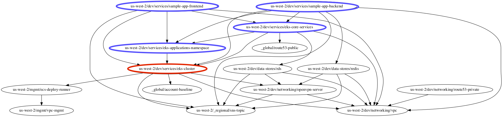

# Undeploying the Reference Architecture

In the previous section, you learned how to check [metrics, logs, and alerts](05-monitoring-alerting-logging.md). In
this section, we'll walk you through how to undeploy parts or all of the Reference Architecture.

1. [Before you get started](#before-you-get-started)
1. [Pre-requisite: force_destroy on S3 buckets](#pre-requisite-force_destroy-on-S3-buckets)
1. [Pre-requisite: understand module dependencies](#pre-requisite-understand-module-dependencies)
1. [Undeploying modules using Gruntwork Pipelines](#undeploying-modules-using-gruntwork-pipelines)
1. [Manually undeploying a single module](#manually-undeploying-a-single-module)
1. [Manually undeploying multiple modules or an entire environment](#manually-undeploying-multiple-modules-or-an-entire-environment)
1. [Removing the terraform state](#removing-the-terraform-state)
1. [Useful Tips](#useful-tips)
1. [Known errors](#known-errors)
1. [Next steps](#next-steps)


## Before you get started

Terraform makes it fairly easy to delete resources using the `destroy` command. This is very useful in testing and
pre-prod environments, but can also be dangerous in production environments, because if you delete resources, **there
is no undo**. Therefore, be extra sure and careful with where you run `destroy` so you don't accidentally end up
deleting something you'll very much regret (e.g., a production database). Also, as explained in the rest of this guide,
we put a few features in place that make deletion harder (read: a bit more annoying to do) to prevent you from
accidentally shooting yourself in the foot.


## Pre-requisite: force_destroy on S3 buckets

By default, if your Terraform code includes an S3 bucket, when you run `terraform destroy`, if that bucket contains
any content, Terraform will _not_ delete the bucket and instead will give you an error like this:

```
bucketNotEmpty: The bucket you tried to delete is not empty. You must delete all versions in the bucket.
```

This is a safety mechanism to ensure that you don't accidentally delete your data.

*If you are absolutely sure you want to delete the contents of an S3 bucket* (remember, there's no undo!!!), all the
services that use S3 buckets expose a `force_destroy` setting that you can set to `true` in your `terragrunt.hcl`
files to tell that service to delete the contents of the bucket when you run `destroy`. Here's a partial list of
services that expose this variable (note, you may not have all of these in your Reference Architecture!):

* `networking/alb`
* `mgmt/openvpn-server`
* `landingzone/account-baseline-app`
* `services/k8s-service`


## Pre-requisite: understand module dependencies

At this point the CI / CD pipeline (Gruntwork Pipelines) only **supports destroying modules that have no downstream dependencies.** You can destroy
multiple modules but only if all of them have no dependencies, and also only if none of them are dependent on each other.

### Undeploying a module with many dependencies

For example, most modules depend on the `vpc` module, fetching information about the VPC using [Terragrunt `dependency`
blocks](https://terragrunt.gruntwork.io/docs/reference/config-blocks-and-attributes/#dependency) or
[aws_vpc](https://www.terraform.io/docs/providers/aws/d/vpc.html) data source. If you undeploy your `vpc`
*before* the modules that depend on it, then any command you try to run on those other modules will fail, as their
data sources will no longer be able to fetch the VPC info!

Therefore, you should only destroy a module if you're sure no other module depends on it! Terraform does not provide
an easy way to track these sorts of dependencies. We have configured the modules here using Terragrunt [`dependency`](https://terragrunt.gruntwork.io/docs/reference/config-blocks-and-attributes/#dependency) blocks, so use those to find dependencies between modules.

You can check the module dependency tree with `graph-dependencies` and GraphViz:

        aws-vault exec <account_profile> -- terragrunt graph-dependencies | dot -Tpng > dep-graph.png
        open dep-graph.png


## Undeploying modules using Gruntwork Pipelines

Consider a reference architecture with this graph in each of the application accounts (dev, stage, prod):



Let's say you've decided you no longer need the `eks-cluster` and want to undeploy it. It involves a several-step process.

1. Undeploy `sample-app-frontend` and `sample-app-backend`.
1. Undeploy `eks-core-services`.
1. Undeploy `eks-applications-namespace`.
1. Undeploy `eks-cluster`.

We'll walk through each of these steps below, using Gruntwork Pipelines.

_NOTE: You can combine changes across all application accounts (i.e., dev, stage, prod) in a single commit, but we
recommend first undeploying one account at a time until you get the hang of it._

### Undeploy sample-apps

#### Update the force_destroy variable

1. First create a branch and push a commit that allows destroying the S3 bucket containing access logs for the
`sample-app-frontend`: [see force_destroy section](#pre-requisite-force_destroy-on-S3-buckets).

        force_destroy_ingress_access_logs = true

1. Open a pull request for that change and verify the plan in CI. You should see a trivial change to update the
`sample-app-frontend` module.
1. Go through the typical git workflow to get the change merged into the main branch.
1. As CI runs on the main branch, watch for the job to be held for approval. Approve the job, and wait for the
`deployment` step to complete so that the `sample-app-frontend` is fully updated with the new variable.

#### Delete the sample-app folders

1. On a new branch push a commit to delete the `sample-app-frontend` and `sample-app-backend` folders.

        # For example, to remove from only dev and stage accounts:
        rm -rf {dev,stage}/us-west-2/{dev,stage}/services/sample-app-{frontend,backend}

1. Open a pull request for that change and verify the plan in CI.
    - Make sure the `plan -destroy` output looks accurate.
    - You should see multiple plan outputs -- one per folder deleted. You'll need to scroll through the plan
    output to see all of them, as it runs `plan -destroy` for each folder individually.
1. Repeat steps 3 & 4 from above.
1. [Remove the terraform state](#removing-the-terraform-state).

### Undeploy the other modules

1. Create a new branch and push a commit that deletes the `eks-core-services` module folder.

        # For example, to remove from only dev and stage accounts:
        rm -rf {dev,stage}/us-west-2/{dev,stage}/services/eks-core-services

1. Open a pull request for that change and verify the plan in CI.
    - Make sure the `plan -destroy` output looks accurate.
    - Be sure to scroll through the entire plan output to see plans for all folders.
1. Repeat steps 3 & 4 from above, including [removing the terraform state](#removing-the-terraform-state).
1. Repeat steps 1-3 from this section for `eks-applications-namespace`, and then `eks-cluster` module folders.


Once completed, there should no longer be an `eks-cluster` or any of its dependencies in the accounts you deleted them
from. You can verify this by logging into the AWS Console.

**NOTE: If you run into timeout errors, try rerunning the job from failure, and they should resolve.** (If they do not,
please [reach out](mailto:support@gruntwork.io) to us.)


## Manually undeploying a single module

You can also bypass the CI / CD pipeline and run destroy locally. For example:

```
cd stage/us-west-2/stage/services/sample-app-frontend
terragrunt destroy
```


## Manually undeploying multiple modules or an entire environment

*If you are absolutely sure you want to run destroy on multiple modules or an entire environment* (remember, there's
no undo!), you can use the `destroy-all` command. For example, to undeploy the entire staging environment, you'd run:

```
cd stage
terragrunt destroy-all
```

Terragrunt will then run `terragrunt destroy` in each subfolder of the current working directory, processing them in
reverse order based on the dependencies you define in the `terragrunt.hcl` files.

To avoid interactive prompts from Terragrunt (use very carefully!!), add the `--terragrunt-non-interactive` flag:

```
cd stage
terragrunt destroy-all --terragrunt-non-interactive
```

To undeploy everything except a couple specific subfolders, add the `--terragrunt-exclude-dir` flag. For example, to
run `destroy` in each subfolder of the `stage` environment except MySQL and Redis, you'd run:

```
cd stage
terragrunt destroy-all \
    --terragrunt-exclude-dir stage/us-east-1/stage/data-stores/mysql \
    --terragrunt-exclude-dir stage/us-east-1/stage/data-stores/redis
```


## Removing the terraform state

**NOTE: Deleting state means that you lose the ability to manage your current terraform resources! Be sure to only
delete once you have confirmed all resources are destroyed.**

Once all the resources for an environment have been destroyed, you can remove the state objects managed by `terragrunt`.
The reference architecture manages state for each environment in an S3 bucket in each environment's AWS account.
Additionally, to prevent concurrent access to the state, it also utilizes a DynamoDB table to manage locks.

To delete the state objects, login to the console and look for the S3 bucket in the environment you wish to undeploy. It
should begin with your company's name and end with `terraform-state`. Also look for a DynamoDB
table named `terraform-locks`. You can safely remove both **once you have confirmed all the resources have been
destroyed successfully**.


## Useful tips

- **Destroy resources in groups instead of all at once.**
    - There are [known instabilities](#known-errors) with destroying many modules at once. In addition, Terragrunt is
      designed to process the modules in a graph, and will not continue on if there is an error. This means that you
      could run into situations where Terragrunt has destroyed a module, but returns an error due to Terraform bugs that
      prevent you from cleanly calling destroy twice.
    - To address these instabilities, it is recommended to destroy the resources in groups. For example, you can start
      by destroying all the services first (e.g., `stage/REGION/stage/services`), then the data stores (e.g.,
      `stage/REGION/stage/data-stores`), and finally the networking resources (e.g., `stage/REGION/stage/networking`).
    - When identifying groups to destroy, use [terragrunt
      graph-dependencies](https://terragrunt.gruntwork.io/docs/reference/cli-options/#graph-dependencies) to view the
      dependency graph so that you destroy the modules in the right order.

- **Empty + Delete S3 buckets using the web console (when destroying whole environments).**
    - As mentioned in [Pre-requisite: force_destroy on S3 buckets](#pre-requisite-force_destroy-on-s3-buckets), it is
      recommended to set `force_destroy = true` prior to running destroy so that terraform can destroy the S3 buckets.
      However, this can be cumbersome if you are destroying whole environments, as it can be difficult to flip the bit in
      every single module.
    - Instead, oftentimes it is faster and more convenient to first empty and then delete the buckets using the AWS web console prior to
      invoking `destroy` with `terragrunt`.
    - **IMPORTANT**: You should only do this if you are intending on destroying an entire environment. Otherwise, it is
      too easy to accidentally delete the wrong S3 bucket.


## Known errors

There are a few reasons your call to `destroy` may fail:

1. **Terraform bugs**: Terraform has a couple bugs ([18197](https://github.com/hashicorp/terraform/issues/18197) and
   [17862](https://github.com/hashicorp/terraform/issues/17862)) that may give the following error when you run
   `destroy`:

    ```
    variable "xxx" is nil, but no error was reported
    ```

    This usually happens when the module already had `destroy` called on it previously and you re-run `destroy`. In
    this case, your best bet is to skip over that module with the `--terragrunt-exclude-dir` (as shown in the previous)
    section.

1. **Missing dependencies**: If you delete modules in the wrong order, as discussed in the [Pre-requisite: understand
   module dependencies](#pre-requisite-understand-module-dependencies) section, then when you try to `destroy` on a
   module that's missing one of its dependencies, you'll get an error about a `data` source being unable to find the
   data it's looking for. Unfortunately, there are no good solutions in this scenario, just a few nasty workarounds:

    1. Run `apply` to temporarily bring back the dependencies.
    1. Update the code to temporarily remove the dependencies and replace them with some mock data.
